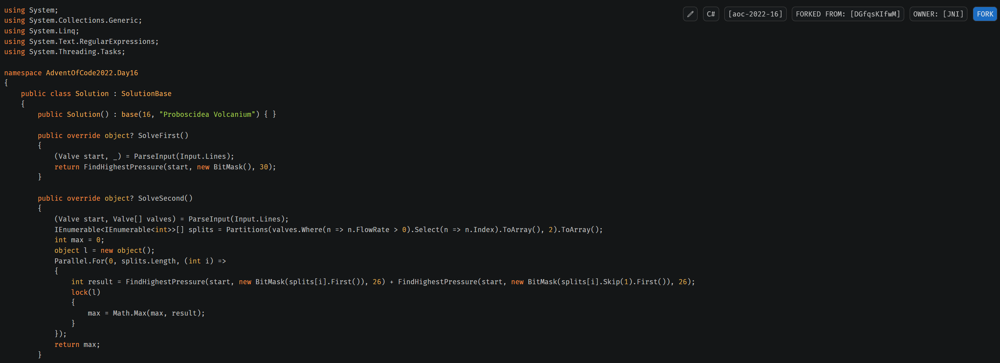

# NoteBin
A self-hosted platform to create and share code snippets. It features a frontend built with React and Typescript and a backend powered by ASP.NET Core 9, written in C# 13.



# Features
- **Note Management**: Create and share notes and code snippets with optional syntax highlighting
- **Forking Notes**: Fork existing notes to create new versions while maintaining a link to the original
- **User Management**: Register new users to create owned notes or create notes without an account
- **Search and Filter**: Search and filter notes by name or owner
- **Permantent and Temporary Storage**: Support for both permanent SQLite and in-memory storage for notes and user data
- **Minimalistic Frontend**: A clean frontend built with React and Typescript for a responsive user experience
- **User Authentication**: Secure user authentication using stateless tokens with HMAC-SHA512

# Structure
The repo contains VS2022 solution and project files for C#13 and ASP.NET Core 9.  
Backend source files are in `src/` with test files in `test`.  
The react frontend source code is located in `frontend/` and uses `npm` and `vite` for package management and building.

### Key Directories
- `src/`: Contains the backend source code
  - `API/`: Controllers for handling HTTP requests
  - `Models/`: Data models and database commands
  - `Services/`: Service classes for business logic
  - `Configuration/`: Configuration definitions and functionality
- `test/`: Contains unit tests for the backend
- `frontend/`: Contains the frontend source code and configuration files
  - `src/`: React components and pages
- `publish/`: Output directory for the compiled frontend and backend

# Building
### Automatic
Run `build.cmd` to compile the frontend and backend and collect all required files in the `publish/` folder.  

### Steps
Alternatively, the frontend and backend can be built manually by following these steps:
1. **Build the frontend**:
    ```sh
    cd frontend
    npm install
    npm run build
    cd ..
    ```

2. **Build the backend**:
    ```sh
    dotnet build "src/NoteBin.csproj" -c Release -o "publish" -p:PublishProfile=Publish
    ```

3. **Copy the web files to the publish folder**:
    ```sh
    cp -r web publish/web
    ```

# Configuration
The `src/appsettings.json` file is used to configure various settings for the backend of the application. This file can be modified to adjust settings such as storage types, connection strings, authentication settings, and server configurations.
The `appsettings.json` will be copied to the `publish` directory when building.

### Configuration options:
1. **Kestrel Settings**:
   - The `Kestrel` section can be used to configure the Kestrel web server, which is used to host the application. Settings such as the host address, port, and HTTPS settings can be adjusted.
   - Example:
     ```json
     "Kestrel": {
       "Endpoints": {
         "Https": {
           "Url": "https://localhost:7188"
         }
       }
     }
     ```
   - For more details, refer to the [Microsoft documentation on Kestrel](https://docs.microsoft.com/en-us/aspnet/core/fundamentals/servers/kestrel)

2. **NoteStorage Settings**:
   - The `NoteStorage` section configures how notes are stored. The available storage types are `SQLite` and `Memory` to create permantent or temporary storages.
   - Example:
     ```json
     "NoteStorage": {
       "StorageType": "SQLite",
       "ConnectionString": "Data Source=data/notes.db",
       "ContentPath": "data/notes/"
     }
     ```
    - When `StorageType` is `SQLite`, a ConnectionString is required. In-memory databases will not work properly!
    - The `ContentPath` specifies a folder where the actual note content will be stored and is only required, if the `StorageType` is `SQLite`.

3. **UserStorage Settings**:
   - The `UserStorage` section configures how user data is stored. Similar to `NoteStorage`, the storage type and connection string can be specified to work with permanent or temporary storage.
   - Example:
     ```json
     "UserStorage": {
       "StorageType": "SQLite",
       "ConnectionString": "Data Source=data/users.db"
     }
     ```

4. **AuthSettings**:
   - The `AuthSettings` section configures authentication settings. The authentication type, key file, key length, token length, and expiration duration have to be adjusted. The only supported auth type is `Stateless`.
   - Example:
     ```json
     "AuthSettings": {
       "AuthType": "Stateless",
       "KeyFile": "data/auth.key",
       "KeyLength": 64,
       "TokenLength": 64,
       "ExpirationDuration": 7776000
     }
     ```
    - The `KeyFile` will be used to store the random secret key used to sign tokens. Deleting it will invalidate all tokens!
    - `KeyLength` and `TokenLength` specify the length in bytes used for the secret key and token generation
    - HMAC-SHA512 is used for generating and validating tokens
    - `ExpirationDuration` is the time in seconds until a token expires

5. **Logging Settings**:
   - The `Logging` section configures the logging behavior of the application. You can set the log level for different categories.
   - Example:
     ```json
     "Logging": {
       "LogLevel": {
         "Default": "Information",
         "Microsoft.AspNetCore": "Warning"
       }
     }
     ```

### Running the application
Assuming `appSettings.json` is correctly configured, starting `NoteBin.exe` from the `publish/` directory will start the server.

# Backend API
See also: [NoteBin.http](src/NoteBin.http)

## User Endpoints
### `POST /api/user`
> Create a new user with a username and password. Usernames are unique and act as identifier for the user.

#### Parameters
| Name     | Required | Type   | Description                                                                 |
|----------|----------|--------|-----------------------------------------------------------------------------|
| username | Yes      | string | The unique username for the new user. Length <= 32, no whitespace, characters: a-z, A-Z, 0-9, _ |
| password | Yes      | string | The password for the new user. Length >= 8, must contain one uppercase, lowercase, and numeric character |

#### Responses
| HTTP Code | Content-Type              | Response                                                                 |
|-----------|---------------------------|--------------------------------------------------------------------------|
| 200       | -                         |                                                                          |
| 400       | application/json          | `{ "error": "Invalid username/password" }`                               |
| 409       | application/json          | `{ "error": "Username already exists" }`                                 |

### `GET /api/user/{name}`
> Get the user with the name provided in the request path

#### Parameters
| Name | Required | Type | Description |
|------|----------|------|-------------|
| name | Yes | string | The username of the user to retrieve |

#### Responses
| HTTP Code | Content-Type     | Response |
|-----------|------------------|----------|
| 200       | application/json | <br><pre lang="json">{&#13;  "username": "string",&#13;  "creationTime": 1736018866165&#13;}</pre> where `creationTime` is the time since epoch in milliseconds |
| 404       | application/json | User was not found |

## Note endpoints
### `POST /api/note`
> Create a new note

#### Headers
| Name          | Required | Description                                                                 |
|---------------|----------|-----------------------------------------------------------------------------|
| Authorization | No       | `Bearer <token>`. For missing or invalid authorization tokens, an unowned note is created |

#### Parameters
| Name          | Required | Type   | Description                                                                 |
|---------------|----------|--------|-----------------------------------------------------------------------------|
| name          | No       | string | The name/title of the note. Used as information on the UI and to find notes |
| fork          | No       | string | The ID of the note that this new note is forked from |
| syntax        | Yes      | string | The syntax highlighting language for the note content. Can be an arbitrary value that <= 32 characters that the frontend understands |
| content       | Yes      | string | The actual content of the note |

#### Responses
| HTTP Code | Content-Type     | Response                                                                 |
|-----------|------------------|--------------------------------------------------------------------------|
| 200       | application/json | <br><pre lang="json">{&#13;  "id": "1kpTjDFdA6"&#13;}</pre> where `id` is the identifier of the created note. |
| 400       | application/json | Bad Request |
| 500       | application/json | Unexpected database error or similar |

### `GET /api/note/{id}`
> Get a note by id

#### Parameters
| Name | Required | Type | Description |
|------|----------|------|-------------|
| id   | Yes | string | Id of the note to retrieve |

#### Responses
| HTTP Code | Content-Type     | Response |
|-----------|------------------|----------|
| 200       | application/json | <br><pre lang="json">{&#13;  "id": "O8vIr1C6UE",&#13;  "name": "Sample Note",&#13;  "owner": "TestUser",&#13;  "fork": "1kpTjDFdA6",&#13;  "creationTime": 1735942466735,&#13;  "syntax": "markdown",&#13;  "content": "..."&#13;}</pre> where `owner` and `fork` can be `null`, if the notes is unowned or not forked. `creationTime` is the time since epoch in milliseconds |
| 404       | application/json | Note was not found |

### `GET /api/note/list`
> List notes with optional filters

#### Parameters
| Name   | Required | Type   | Description                                                                 |
|--------|----------|--------|-----------------------------------------------------------------------------|
| offset | Yes      | long   | The offset from where to start listing notes                                |
| amount | Yes      | long   | The number of notes to list                                                 |
| owner  | No       | string | The username of the owner to filter notes by                                |
| filter | No       | string | A string to filter notes by name                                            |

#### Responses
| HTTP Code | Content-Type     | Response                                                                 |
|-----------|------------------|--------------------------------------------------------------------------|
| 200       | application/json | <br><pre lang="json">{&#13;  "notes": [&#13;    {&#13;      "id": "O8vIr1C6UE",&#13;      "name": "Sample Note",&#13;      "owner": "TestUser",&#13;      "fork": "1kpTjDFdA6",&#13;      "creationTime": 1735942466735,&#13;      "syntax": "markdown",&#13;      "content": "..."&#13;    }&#13;  ],&#13;  "total": 1&#13;}</pre> where `notes` is an array of note objects and `total` is the total number of notes matching the filters |
| 400       | application/json | Bad Request |

## Auth Endpoints
### `POST /api/auth`
> Authenticate a user and return a token for the client

#### Parameters
| Name     | Required | Type   | Description                                                                 |
|----------|----------|--------|-----------------------------------------------------------------------------|
| username | Yes      | string | The username of the user                                                    |
| password | Yes      | string | The password of the user                                                    |

#### Responses
| HTTP Code | Content-Type     | Response                                                                 |
|-----------|------------------|--------------------------------------------------------------------------|
| 200       | application/json | <br><pre lang="json">{&#13;  "token": "string"&#13;}</pre> where `token` is the token to be saved by the client |
| 401       | application/json | Unauthorized                                                             |

### `GET /api/auth`
> Validate a token from the client

#### Headers
| Name          | Required | Description                                                                 |
|---------------|----------|-----------------------------------------------------------------------------|
| Authorization | Yes      | `Bearer <token>`                                                            |

#### Responses
| HTTP Code | Content-Type | Response |
|-----------|--------------|----------|
| 200       | -            |          |
| 400       | -            | Bad Request, if the token is missing in the Authorization header |
| 401       | -            | Unauthorized, if the token is invalid |

### `DELETE /api/auth`
> Logout a user by invalidating the token. This only ensures that the token is valid. The client still has to forget it

#### Headers
| Name          | Required | Description                                                                 |
|---------------|----------|-----------------------------------------------------------------------------|
| Authorization | Yes      | `Bearer <token>`                                                            |

#### Responses
| HTTP Code | Content-Type | Response |
|-----------|--------------|----------|
| 200       | -            |          |
| 400       | -            | Bad Request, if the token is missing in the Authorization header |
| 401       | -            | Unauthorized, if the token is invalid |
